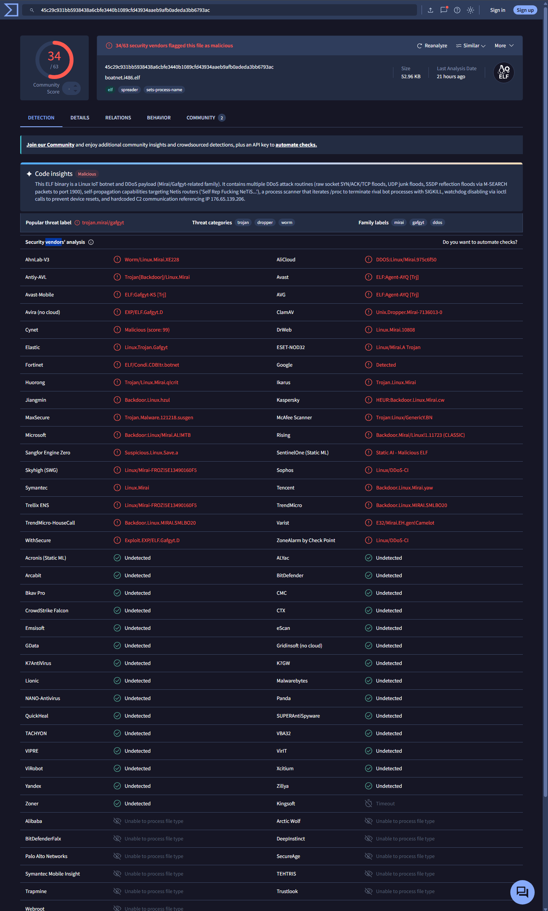
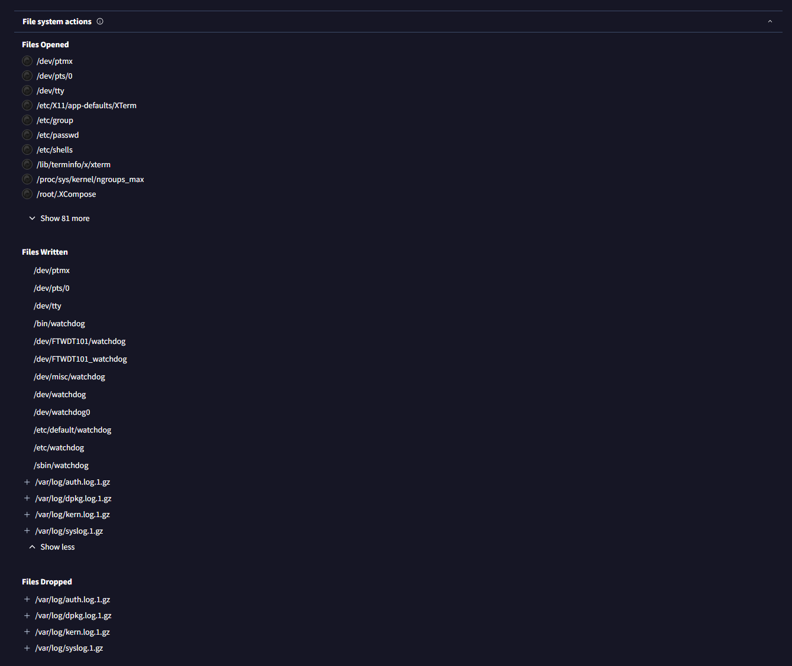
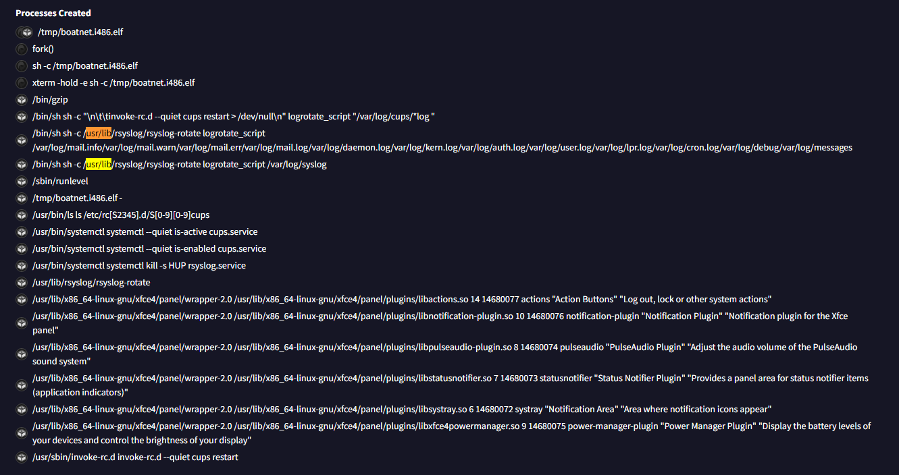
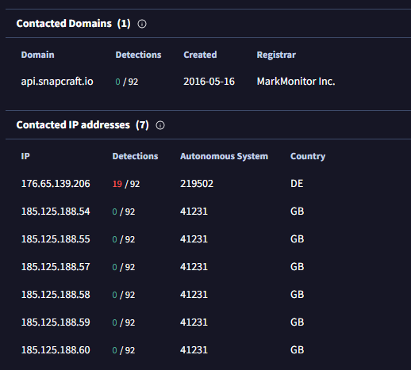
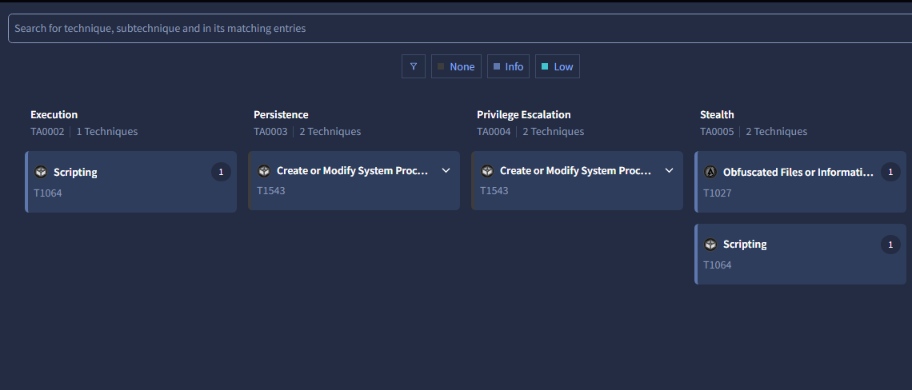
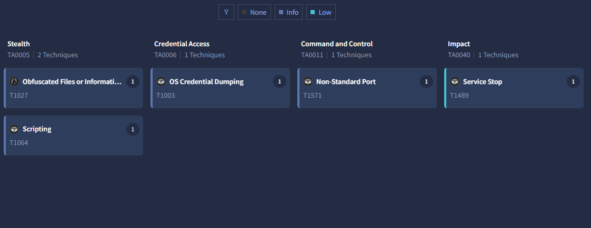

# DANIEL.GUY - Malware Sample Analysis: Mirai / Gafgyt (Linux ELF)

## Summary
This report analyzes a malware sample identified by its SHA256 hash using VirusTotal and MalwareBazaar. No sample was downloaded or executed. All findings come from public threat intelligence and sandbox reports. The sample is a Linux IoT botnet and DDoS payload from the Mirai/Gafgyt family. It contains several DDoS attack routines (raw socket SYN/ACK/TCP floods, UDP junk floods, and SSDP reflection floods using M-SEARCH packets to port 1900). It also has a self-replication routine that targets Netis routers, a process scanner that loops through /proc and kills rival bot processes with SIGKILL, watchdog disabling through ioctl calls so the device does not reset, and a hardcoded C2 server at 176[.]65[.]139[.]206.

## Sample Details
| Field | Value |
|---|---|
| SHA256 | 45c29c931bb5938438a6cbfe3440b1089cfd43934aaeb9afb0adeda3bb6793ac |
| MD5 | 5e13490160f547737a0d57d7094b9244 |
| SHA1 | f67eb1d0411d8c19f3d88e6ee36ba52ba293e596 |
| File type | ELF |
| File size | 52.96 KB (54236 bytes) |
| First seen | 2026-10-06 01:40:04 UTC |
| Source | MalwareBazaar / VirusTotal |

## Detection Results (VirusTotal)
- Detection ratio: 34 / 63 engines flagged the file as malicious
- Popular threat label: trojan.mirai/gafgyt
- Screenshot: 

## Behavior Analysis (Behavior tab)
- Processes created:
  - /tmp/boatnet.i486.elf (the sample, run from /tmp)
  - fork() (the sample spawns a child copy of itself)
  - sh -c /tmp/boatnet.i486.elf
  - xterm -hold -e sh -c /tmp/boatnet.i486.elf
- Other processes in the report (logrotate, rsyslog, cups, systemctl, xfce4 panel plugins) are normal background activity from the sandbox and were not counted as malware behavior.
- Files dropped: none observed.
- Files accessed: the sample probes many watchdog device and config paths, which fits its routine to disable the device watchdog so the device is not rebooted:
  - /dev/watchdog, /dev/watchdog0, /dev/misc/watchdog
  - /dev/FTWDT101/watchdog, /dev/FTWDT101_watchdog
  - /bin/watchdog, /sbin/watchdog, /etc/watchdog, /etc/default/watchdog
- Registry changes: none (Linux system)
- Network activity:
  - TCP 176[.]65[.]139[.]206:3778 (C2 server, non-standard port)
  - api[.]snapcraft[.]io (185[.]125[.]188[.]58:443) is background traffic from the sandbox Ubuntu system and is not tied to the malware.
- Screenshots:  

## Relationships (Relations tab)
- Contacted IPs: 176[.]65[.]139[.]206 (C2)
- Other contacted domains and IPs (api[.]snapcraft[.]io and 185[.]125[.]188[.]54 through .60) belong to the Ubuntu snap store and are sandbox background traffic.
- Dropped files: N/A
- Execution parents: N/A
- Screenshot: 

## MITRE ATT&CK Mapping
| Tactic | Technique | ID |
|---|---|---|
| Execution | Scripting | T1064 |
| Persistence | Create or Modify System Process | T1543 |
| Privilege Escalation | Create or Modify System Process | T1543 |
| Stealth (Defense Evasion) | Obfuscated Files or Information | T1027 |
| Stealth (Defense Evasion) | Scripting | T1064 |
| Credential Access | OS Credential Dumping | T1003 |
| Command and Control | Non-Standard Port | T1571 |
| Impact | Service Stop | T1489 |

Notes: These mappings come from VirusTotal's automated sandbox analysis. T1064 has since been merged into T1059 (Command and Scripting Interpreter) by MITRE. The flood attacks described in the summary also map to T1498 (Network Denial of Service).
- Screenshots:  

## Indicators of Compromise (defanged)
| Type | Value |
|---|---|
| SHA256 | 45c29c931bb5938438a6cbfe3440b1089cfd43934aaeb9afb0adeda3bb6793ac |
| MD5 | 5e13490160f547737a0d57d7094b9244 |
| SHA1 | f67eb1d0411d8c19f3d88e6ee36ba52ba293e596 |
| C2 IP:Port | 176[.]65[.]139[.]206:3778 |
| File name | boatnet.i486.elf |
| File path | /tmp/boatnet.i486.elf |

## Detection and Response Recommendations
- Block the file hashes in EDR and antivirus tools.
- Block 176[.]65[.]139[.]206 at the firewall and alert on any outbound traffic to port 3778.
- Alert on executables running from /tmp or other world-writable folders.
- Alert on non-system processes opening /dev/watchdog, and on processes that loop through /proc and kill other processes.
- Watch for unusual outbound traffic from IoT devices and routers, such as high-volume SYN or UDP floods and SSDP (port 1900) M-SEARCH packets from devices that should not send them.
- If found on a host: isolate the device, keep a copy of the binary for analysis, kill the process, check for persistence (cron jobs, init scripts, services), change default or weak credentials, and update the firmware.
- Prevention: change default passwords, disable Telnet and exposed SSH, and patch routers and IoT devices.
- User awareness: this family typically spreads by scanning for devices with weak or default credentials and unpatched vulnerabilities, not through phishing.

## Conclusion
This sample is a Mirai/Gafgyt-style Linux botnet that turns infected routers and IoT devices into DDoS attack tools. It spreads on its own, kills competing malware, and disables the watchdog to stay running. It is dangerous mainly because infected devices are used to attack others, and they are often unmonitored. A SOC analyst can best detect it through outbound connections to the C2 IP and port, executables running from /tmp, and abnormal flood traffic from IoT devices.

## Plain English Explanation
Imagine a stranger quietly sneaks into your house and takes control of your smart devices, like your router or a camera, without you ever noticing. Then they use thousands of hijacked devices from other homes to all send fake requests to one website at the same time, until the site gets overwhelmed and crashes.

Security companies keep a giant shared list of known bad files like this one. I looked this one up on that list, without ever opening it, and read the reports from test computers that safely ran it. This showed what it does, who it contacts, and how to spot it. Companies use this information to block it before it reaches anyone.

## Tools Used
VirusTotal, MalwareBazaar, MITRE ATT&CK

## Disclaimer
Static research only. No malware is stored in this repository.
